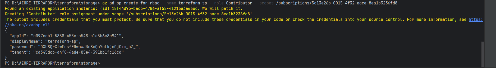

START AZURE TERRAFORM MODULE
# create a service principal for terraform with contributor role:

# az ad sp create-for-rbac --name terraform-sp --role Contributor --scopes /subscriptions/5c13e26b-0015-4f32-aace-8ea1b3236fd8

